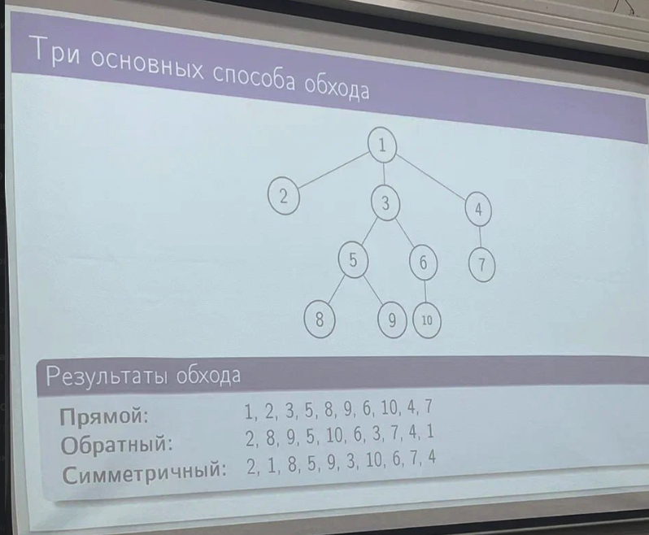
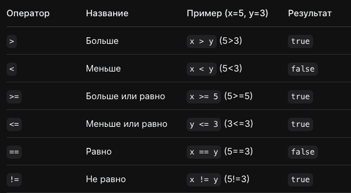
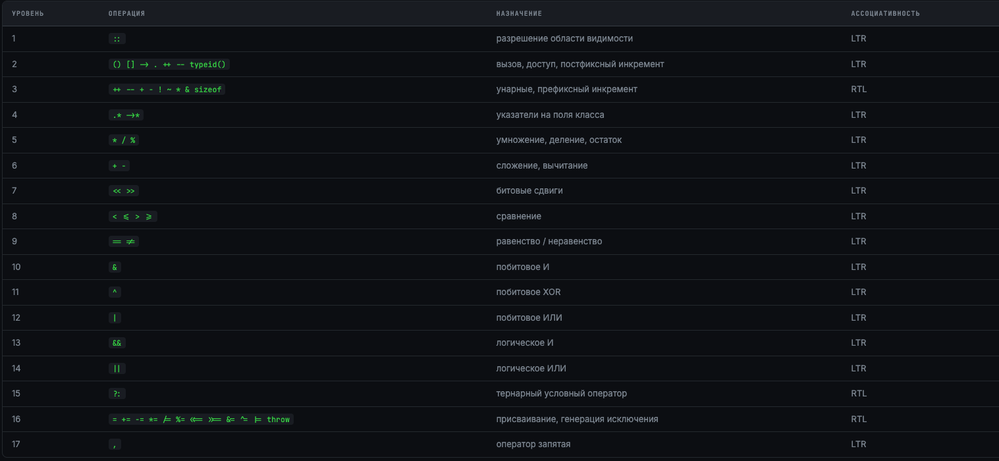

# Экзамен / Конспект

## 1. Множественный тип данных.

**Множественный тип данных** - это тип данных, который реализует математическое множество в программировании.

### Синтаксис объявления на примере Pascal

```pascal
type название set of тип данных хранимых во множестве (для того чтобы использовать много где)
var название: set of тип данных хранимых во множестве (чтобы единично задать)
```

### Реализация на паскале

Битовая карта (Hash-таблица)

Каждому элементу базового типа соответствует **один бит** (в Hashset зависит от типа)

**Память:** ⌈(Max−Min+1)/8⌉ байт (в Hashset нет фиксированого)

**Ограничение:** базовый тип ≤ 256 элементов (для обычного pascal, в pascal ABC при кол-ве элементов больше чем 256 pascal автоматически начинает работать с HashSet<Type.>)

### Основные операции в порядке приоритета от высшего к низшему

```text
 * | +, - | =, <>, <=, >= | in
```

### Примеры

```pascal
program CountDigits;
var
  S : string;
  i, k : integer;
begin
  writeln('Введите строку:'); readln(S);
  k := 0;
  for i := 1 to length(S) do
    if S[i] in ['0'..'9'] then
      k := k + 1;
  writeln('Количество цифр: ', k);
end.
```

```pascal
program CheckChar;
var ch : char;
begin
  writeln('Введите символ:'); readln(ch);
  if ch in ['0'..'9'] then
    writeln(ch, ' - это цифра')
  else if ch in ['a'..'z', 'A'..'Z'] then
    writeln(ch, ' - это буква')
  else if ch in ['+', '-', '*', '/'] then
    writeln(ch, ' - знак операции')
  else
    writeln(ch, ' - другой символ');
end.
```

---

## 2. Комбинированный тип данных – запись. Синтаксис объявления (на примере Pascal / С/С++), семантика, прагматика.

**Запись (комбинированный тип)** — структурированный тип данных, состоящий из фиксированного числа компонент (полей, атрибутов) различных типов. Элемент записи называется **полем**. Поля могут быть любого типа, включая другие записи.

### Семантика

Запись — тип, значением которого является кортеж значений полей. Поля хранятся последовательно в памяти.

### Синтаксис

```pascal
type zapis = record
  Field_1 : TypeOfField_1;
  Field_2 : TypeOfField_2;
  ...
  Field_N : TypeOfField_N;
end;
```

### Прагматика

Моделирование объектов реального мира (студент, дата, точка). Решение — собрать связанные данные в один комбинированный тип.

---

## 3. Комбинированный тип данных – запись. Оператор селектора записи. Действия над отдельными полями и над записями в целом.

Доступ к полю записи осуществляется через **оператор-селектор**:

```pascal
var Teacher, Student : Person;
begin
  Student.LastName := 'Иванов';
  Student.Name     := 'Петр';
  Student.Form     := Day;
  Student.AvgGrade := 4.5;
end.
```

Имена полей в пределах одной записи должны быть уникальными. В различных записях имена полей могут совпадать.

### Оператор with

```pascal
{ Без with }
Student.Name           := 'Ольга';
Student.Birthday.Day   := 1;
Student.Birthday.Month := 3;
Student.Birthday.Year  := 1982;

{ С with — поля доступны по имени напрямую }
with Student, Birthday do begin
  Name  := 'Ольга';
  Day   := 1;
  Month := 3;
  Year  := 1982;
end;
```

### Оператор присваивания и сравнение

var Teacher, Student : Person;
begin
  { Присваивание — копируются все поля }
  Teacher := Student;

  { Сравнение записей — только по полям, не целиком! }
  if (Teacher.SurName = Student.SurName) and
     (Teacher.Name = Student.Name) then
    writeln('Одинаковые');
  { НЕЛЬЗЯ: if Teacher = Student then ... ← ошибка! }
  { Нельзя сравнить две записи целиком одной операцией }
  { Нужно сравнивать поля по отдельности }
end.


### Передача записей в процедуру

```pascal
{ По значению — минус: медленно (копия) }
procedure Print(p : Person);
begin writeln(p.Name); end;

{ По const-ссылке — плюсы: быстро, безопасно }
procedure Print(const p : Person);
begin writeln(p.Name); end;

{ По ссылке (var) — плюс: быстро; минус: опасно }
procedure ChangeName(var p : Person; newName : string);
begin p.Name := newName; end;
```

---

## 4. Статические и динамические данные. Атрибут памяти переменной.

### Статические данные

Размер и время жизни определяются **на этапе компиляции**. Размещаются на стеке или в сегменте данных. Управление памятью автоматическое.

- Глобальные переменные
- Локальные переменные (стек)
- Массивы фиксированного размера

### Динамические данные

Создаются **во время выполнения** программы в куче (heap). Требуют явного управления: `New` / `Dispose` в Pascal, `new` / `delete` в C++.

- Создаются через `New(p)`
- Освобождаются через `Dispose(p)`
- Доступ — только через указатель

| Класс | Объявление | Хранение | Время жизни | Видимость |
|---------|---------|---------|---------|---------|
| Глобальный | Вне подпрограмм | Сегмент данных | Вся программа | Вся программа |
| Локальный | Внутри процедуры | Стек | Вызов процедуры | Процедура |
| Динамический | Через `New` | Куча | До `Dispose` | Через указатель |

---

## 5. Адресный тип данных, указатели: синтаксис объявления, семантика, прагматика.

**Указатель (pointer)** — переменная, значением которой является **адрес** ячейки памяти. Тип указателя определяет, как интерпретировать данные по этому адресу. Указатель занимает 4 байта (32-бит) или 8 байт (64-бит) независимо от типа, на который ссылается.

### Синтаксис

```pascal
type
  PInteger = ^integer;
  PReal    = ^real;
  PChar    = ^char;
  PNode    = ^Node;

  Node = record
    Data : integer;
    Next : PNode;
  end;

var
  p  : PInteger;
  p2 : PInteger = nil;
```

### Семантика

```pascal
var
  x : integer;
  p : ^integer;
begin
  x := 10;
  p := @x;
  writeln(p^);
  p^ := 20;
  writeln(x);
  p := nil;
end.
```

### Прагматика

- Динамическое выделение памяти (`New`/`Dispose`)
- Построение динамических структур (списки, деревья)
- Передача больших объектов без копирования
- Возврат нескольких значений из функции

---

## 6. Адресный тип данных, операции с указателями на статические переменные.

```pascal
var
  a, b : integer;
  p, q : ^integer;
begin
  a := 100;  b := 200;
  p := @a;              { p указывает на a }
  q := @b;              { q указывает на b }

  writeln(p^);          { 100 — значение a через указатель }
  p^ := 150;            { a теперь = 150 }
  writeln(a);           { 150 }

  { Сравнение указателей }
  if p = q then         { FALSE — разные адреса }
    writeln('Одна и та же переменная');
  p := q;               { теперь p указывает на b }
  writeln(p^);          { 200 }
end.
```

---

## 7. Адресный тип данных, операции с указателями на динамические переменные.

```pascal
var p : ^integer;
begin
  New(p);            { выделить память в куче }
  p^ := 42;          { записать значение по адресу }
  writeln(p^);       { 42 }
  Dispose(p);        { освободить память ← ОБЯЗАТЕЛЬНО! }
  p := nil;           { обнулить указатель }
end.
```

```pascal
type
  PStudent = ^Student;

  Student = record
    Name  : string[20];
    Grade : real;
  end;

var ps : PStudent;
begin
  New(ps);
  ps^.Name  := 'Иван';
  ps^.Grade := 4.5;
  writeln(ps^.Name, ': ', ps^.Grade);
  Dispose(ps);
  ps := nil;
end.
```

### Типичные ошибки

**Утечка памяти:** создали через `New`, забыли `Dispose`.

**Висячий указатель:** вызвали `Dispose(p)`, потом обратились к `p^`.

**Двойное освобождение:** вызвали `Dispose` дважды.

После `Dispose` всегда пишите `p := nil`.

---

## 8. Динамические структуры данных. Линейный односвязный список. Организация, принцип использования.

Линейный односвязный список — динамическая структура данных, в которой каждый элемент (узел) содержит данные и указатель на **следующий** узел. Последний узел указывает на `nil`. Доступ к элементам — только последовательный, начиная с головы.

+ рисунок

### Преимущества

- Динамический размер
- Вставка/удаление в начало O(1)
- Нет ограничений на размер (кроме памяти)

### Недостатки

- Нет прямого доступа по индексу
- Поиск и доступ к концу — O(n)
- Дополнительная память на указатели

---

## 9. Динамические структуры данных. Линейный двусвязный список. Организация, принцип использования.

В двусвязном списке каждый узел содержит два указателя: на **следующий** и на **предыдущий** узел. Это позволяет обходить список в обоих направлениях и удалять элементы за O(1) без поиска предшественника.

### Преимущества над односвязным

- Обход в обоих направлениях
- Удаление узла без поиска предшественника — O(1)
- Вставка перед заданным узлом — O(1)

### Недостатки

- Больше памяти на узел (два указателя)
- Сложнее реализация операций

---

## 10. Динамические структуры данных: стек, очередь, кольцо. Организация, принцип использования.

### 1. Стек (Stack)

- **Принцип работы:** LIFO (Last In — First Out, «последним пришёл — первым ушёл»).
- **Аналогия:** Стопка тарелок.
- **Основные операции:** `push`, `pop`.
- **Где используют:** Ctrl+Z, call stack, DFS.
- Имеет 1 указатель.

### 2. Очередь (Queue)

- **Принцип работы:** FIFO (First In — First Out, «первым пришёл — первым ушёл»).
- **Аналогия:** Очередь в магазине.
- **Основные операции:** `enqueue`, `dequeue`.
- **Где используют:** Очереди печати, серверы, BFS.
- Имеет 2 указателя.

### 3. Кольцо (Ring / Circular Buffer)

- Также называют кольцевым буфером.
- Конец памяти соединён с началом.
- После конца массива указатель переходит в начало.
- Имеет 1 указатель.

### Сравнение

- **Стек:** Клади и бери сверху.
- **Очередь:** Вставай в конец, бери из начала.
- **Кольцо:** Ходим по кругу фиксированного размера.

---

## 11. Алгоритм добавления элемента в линейный односвязный динамический список.
[11-12.pas](./Примеры/11-12.pas)
---

## 12. Алгоритм удаления элемента из линейного односвязного динамического списка.
[11-12.pas](./Примеры/11-12.pas)
---

## 13. Обратная польская запись арифметического выражения: определение, синтаксис, семантика, прагматика.

**Обратная польская запись (ОПЗ, RPN)** — постфиксная форма записи математических выражений, в которой оператор ставится **после** своих операндов. Не требует скобок и правил приоритета при вычислении.

| Нотация | Пример | Скобки нужны? |
|----------|---------|---------|
| Инфиксная (обычная) | `(3 + 4) * 2` | Да |
| Префиксная (польская) | `* + 3 4 2` | Нет |
| Постфиксная (ОПЗ) | `3 4 + 2 *` | Нет |

### Примеры

```text
a + b * c         →  a b c * +
(a + b) * c       →  a b + c *
(3 + 4) * 2       →  3 4 + 2 *
a + b * c - d / e →  a b c * + d e / -
```

### Прагматика

ОПЗ используется компиляторами и интерпретаторами для вычисления выражений. Алгоритм вычисления прост: обход слева направо, числа — в стек, оператор — взять два операнда из стека, вычислить, результат — обратно в стек.

---

## 14. Алгоритм «Сортировочная станция» на основе динамического стека.
Преобразование инфиксной (обычной математической) записи в ОПЗ.

1. Читаем символы строки по одному слева направо.
2. Если символ — число (операнд), тогда отправляем на выход.
3. Если символ — операция (+, -, *, /):
   - Пока в стеке есть операции с приоритетом выше или равным, перекладываем их на выход.
   - Затем перемещаем текущую операцию в стек.
4. Если скобка `(`:
   - Помещаем в стек.
5. Если `)`:
   - Перекладываем операции из стека на выход до тех пор пока не встретим открывающую скобку.
   - Открывающую скобку отбрасываем.
   - Если скобка не найдена — ошибка.
6. Когда символы закончились, перекладываем операции из стека на выход.

---

## 15. Алгоритм «Стековая машина» на основе динамического стека.
Преобразование ОПЗ в математическое выражение (постфиксную) (так делает комплилятор)

1. Читаем символы входной строки один за другим
2. Если символ - число, то помещаем в стек
3. Если символ - операция, то
- Извлекаем из стека столько операндов, сколько требует операция для бинарных +, -, *, / это два операнда. Первым извлекается второй операнд (вершина стека) (то есть если в стеке 4 5 6, и появилась операция -, мы извлекаем a=5, а после b=6 и проводим операцию b-a)
- Выполняем операцию
- Результат помещаем обратно в стек
4. Когда вход закончился, результат - единственное число в стеке.

---

## 16. Динамическая структура данных – дерево. Общие понятия (корень, узел, путь, глубина, предок-потомок, родитель-сын).

Это структура данных, состоящая из узлов, связанных между собой отношениями «родитель-потомок». У дерева есть **один корень**, и между любыми двумя узлами существует **ровно один путь**.

| Термин | Определение |
|----------|----------|
| Корень (root) | Единственный узел без родителя |
| Узел (node) | Элемент дерева с данными и связями |
| Лист (leaf) | Узел без потомков |
| Ребро (edge) | Связь родитель → потомок |
| Путь (path) | Последовательность узлов |
| Глубина узла | Длина пути от корня |
| Высота дерева | Максимальная глубина |
| Предок | Узел на пути от корня |
| Потомок | Узел в поддереве |
| Родитель | Непосредственный предок |
| Сын | Непосредственный потомок |
| Братья | Узлы с одним родителем |

---

## 17. Динамическая структура данных – дерево. Обходы дерева (прямой, обратный, симметричный).



---

## 18. Алгоритм построения бинарного дерева синтаксического разбора.

1. Создаем root (пустой корневой узел) объявляем его текущим узлом.
2. Считываем C:
   - Если `(` тогда создаем левого потомка и переходим к нему.
   - Если операция тогда записываем и создаем правого потомка переходим к нему.
   - Если операнд тогда записываем и возвращаемся к родителю.
   - Если `)` тогда возвращаемся к родителю.
3. Если конец строки не достигнут переходим к пункту 2.

---

## 19. Модульный подход для разработки программ. Стандарты модульного программирования.

**Модульное программирование** — метод разработки программ путём их разбиения на самостоятельные функциональные части — **модули**, каждый из которых выполняет конкретную, чётко определённую задачу.

### Ключевые принципы

- Единственность ответственности
- Инкапсуляция
- Минимальный интерфейс
- Независимость
- Переиспользуемость

### Метрики качества

**Сцепление (cohesion)** — чем выше, тем лучше.

**Связность (coupling)** — чем ниже, тем лучше.

---

## 20. Общая структура модуля, интерфейс и исполнительная часть модуля (на примере Pascal).

Также есть файлы module1.pas и mod.pas для более понятного примера.

```pascal
unit ИмяМодуля;       // 1. Заголовок модуля
interface            // 2. Раздел интерфейса
  // Здесь объявляются константы, типы, переменные, заголовки
  // процедур и функций, которые будут видны "извне".
  procedure PublicProcedure;
implementation       // 3. Раздел реализации
  // Здесь описываются внутренние детали модуля.
  // Содержит код процедур и функций, объявленных в interface.
  // Также здесь могут быть внутренние ("скрытые") типы и переменные.
  procedure PublicProcedure;
  begin
    // Реализация процедуры
  end;
  // Эта процедура видна только внутри модуля
  procedure InternalProcedure;
  begin
    // ...
  end;
initialization       // 4. Раздел инициализации (необязательный)
  // Код, который выполняется один раз при загрузке модуля.
  // Например, для установки начальных значений переменных.
finalization         // 5. Раздел финализации (необязательный)
  // Код, который выполняется при завершении работы программы.
  // Используется для "очистки", например, закрытия файлов.
end.
```

---


---

## 21. Язык программирования С++. Базовая структура программы-функции. Общий синтаксис заголовка и тела функции.

Базовая структура программы-функции.
```cpp
// 1. Директивы препроцессора
#include <iostream>
#include <cmath>
using namespace std;

// 2. Глобальные объявления
const double PI = 3.14159265;

// 3. Прототипы (предварительные объявления) функций
double circleArea(double r);
double circlePerimeter(double r);

// 4. Определения функций
double circleArea(double r) {
    return PI * r * r;
}
double circlePerimeter(double r) {
    return 2 * PI * r;
}

// 5. Главная функция — точка входа
int main() {
    double r;
    cout << "Введите радиус: ";
    cin >> r;
    cout << "Площадь: " << circleArea(r) << endl;
    return 0;
}
```

```cpp
// Прототип (объявление) — компилятор узнаёт о функции заранее
int sum(int a, int b);

int main()
{
    int result = sum(5, 3);
    return 0;
}

// Определение (реализация) — может быть где угодно
int sum(int a, int b)
{
    return a + b;
}
```

Синтаксис заголовка функции
```cpp
void sayHello()                         // без параметров
int  add(int a, int b)                   // два параметра
double power(double base, int exp = 2)  // параметр по умолчанию
int& getElement(int* arr, int i)         // возврат по ссылке
const std::string& getName(const Person& p) // const-ссылка
```

---

## 22. Язык программирования С++. Операторы объявления, элементарные операторы действия, операторы присваивания.

```cpp
int x;
double y = 3.14;
int a = 5, b = 10;
int c(7);
int d{9};
const int MAX = 100;
constexpr double PI = 3.14159;
```

```cpp
// Простое присваивание
x = 20;

// Составные операторы присваивания
x += 5;
x -= 3;
x *= 2;
x /= 4;
x %= 3;

// Битовые составные операторы
x &= 0xFF;
x |= 0x01;
x ^= 0x0F;
x <<= 2;
x >>= 1;

// Инкремент/декремент
x++;
++x;
x--;
--x;
```

| Составной оператор | Эквивалент |
|-------------------|------------|
| `x &= y` | `x = x & y` |
| `x |= y` | `x = x \| y` |
| `x ^= y` | `x = x ^ y` |
| `x <<= n` | `x = x << n` |
| `x >>= n` | `x = x >> n` |

---

## 23. Язык программирования С++. Неэлементарные операторы действия.

### if-else

```cpp
if (условие) {
    // выполняется, если условие истинно
} else if (другое_условие) {
    // выполняется, если первое условие ложно
} else {
    // выполняется, если все условия ложны
}
```

### Тернарный оператор

Это не оператор ветвления, а **оператор, возвращающий значение**.

```cpp
условие ? значение_если_истина : значение_если_ложь
```

```cpp
string sign = (x > 0) ? "+" : (x < 0) ? "-" : "0";
```

### switch

```cpp
switch (day) {
    case 1: cout << "Пн"; break;
    case 2: cout << "Вт"; break;
    default: cout << "?"; break;
}
```

### while, do-while, for, range-based for


```cpp
// while — условие проверяется ДО итерации
int i = 0;
while (i < 10) {
    cout << i << " ";
    i++;
}

// do-while — условие проверяется ПОСЛЕ
int n;
do {
    cin >> n;
} while (n <= 0);

// for — счётный цикл
for (int i = 0; i < 10; i++)
    cout << i << " ";

// Range-based for
int arr[] = {1,2,3,4,5};

for (int x : arr)
    cout << x << " ";

for (int& x : arr)
    x *= 2;

for (const int& x : arr)
    cout << x;
```

Где нельзя использовать range-based for:

- Когда нужен индекс элемента.
- Когда нужен не весь диапазон.
- Когда нужен шаг, отличный от 1.

---

## 24. Система типов С++. Базовые числовые типы (целые числа, числа с плавающей точкой, «символьный» тип char).

| Тип | Размер | Диапазон / Точность | Примечание |
|------|------|------|------|
| `bool` | 1 байт | true / false | true=1, false=0 |
| `char` | 1 байт | −128..127 или 0..255 | Символьный ИЛИ целочисленный |
| `short` | 2 байта | −32768..32767 | |
| `int` | 4 байта | −2147483648..2147483647 | Основной целый тип |
| `long long` | 8 байт | ±9.2×10¹⁸ | Суффикс LL |
| `float` | 4 байта | ~7 значащих цифр | Суффикс f |
| `double` | 8 байт | ~15 значащих цифр | По умолчанию вещественный |
| `long double` | 8–16 байт | ~18–19 цифр | Суффикс L |

```cpp
char c = 'A';

cout << c << endl;
cout << (int)c << endl;
cout << (char)(c+1) << endl;
```

```cpp
signed char value = -128;

signed char absValue =
    (value < 0) ? -value : value;

cout << (int)absValue;
```

---

## 25. Система типов С++. Целочисленные типы данных. Изображения целочисленных констант в различных системах счисления. Операции над целочисленными данными.
(не знаю насколько это верный пункт, не нашел инфы)

### Системы счисления

```cpp
int dec = 25;      // десятичная
int oct = 031;     // восьмеричная
int hex = 0x19;    // шестнадцатеричная
int bin = 0b11001; // двоичная (C++14)
```

### Основные операции

```cpp
int a = 10;
int b = 3;

a + b;
a - b;
a * b;
a / b;
a % b;
```

---

## 26. Система типов С++. Вещественные типы данных. Изображения числовых констант с плавающей точкой, квалификаторы вещественных типов.
(не знаю насколько это верный пункт, не нашел инфы)

```cpp
double x = 3.14;
double y = 2.5e3;
double z = 1.2E-4;

float f = 3.14f;
long double ld = 3.14L;
```

### Квалификаторы

- `float`
- `double`
- `long double`

---

## 27. Система типов С++. Логический тип данных, особенности представления и использования. Логические выражения, логические операции и операции отношения. Условные выражения.

**Логический тип** - тип данных принимающий 2 значения (истина (1), ложь (0))

**Размер:** Обычно 1 байт.

Ключевая особенность C++ — **неявное приведение к bool**.

- Из чисел в bool:
  - 0 → false
  - не 0 → true

- Из bool в число:
  - false → 0
  - true → 1

```cpp
bool a = true, b = false;

cout << (a && b) << endl;
cout << (a || b) << endl;
cout << (!a) << endl;
```

### Короткое замыкание

```cpp
int x = 0;

if (x != 0 && 10/x > 1)
    cout << "ok";

int* p = nullptr;

if (p != nullptr && *p > 0)
    cout << "ok";
```

### Условное выражение

```cpp
(условие) ? (если_true) : (если_false)
```

```cpp
int a = 10, b = 20;

int max = (a > b) ? a : b;
```

### Операции отношения


---

## 28. С++: арифметические выражения, приоритет операций. Неявное и явное преобразование типов. Определение размера переменной или значения в типе.

### Целочисленные повышения

```cpp
char
short
unsigned char
```

перед операциями преобразуются в `int`.

```cpp
int i = 5;
double d = 3.0;

double result = i + d;
```

### Ловушка

```cpp
int a = 7;
int b = 2;

double c = a / b;
double d2 = (double)a / b;
```

| Вид | Синтаксис | Опасность |
|------|------|------|
| C-style cast | `(int)x` | Может всё |
| static_cast | `static_cast<int>(x)` | Безопаснее |
| reinterpret_cast | `reinterpret_cast<int&>(f)` | UB |
| const_cast | `const_cast<T*>(p)` | Может привести к падению |

### sizeof

```cpp
cout << sizeof(int) << endl;
cout << sizeof(double) << endl;
cout << sizeof(long long) << endl;

int arr[10];

cout << sizeof(arr) << endl;
cout << sizeof(arr)/sizeof(arr[0]) << endl;
```

---

## 29. Порядок выполнения операций в смешанных выражениях С++, приоритет и ассоциативность операций.



---

## 30. Битовые операции С++: битовые сдвиги, логические битовые операции. Примеры использования битовых операций.
(не знаю насколько это верный пункт, не нашел инфы)

### Битовые операции

```cpp
a & b
a | b
a ^ b
~a
```

### Сдвиги

```cpp
a << n
a >> n
```

### Примеры

```cpp
int x = 5;

x << 1;
x >> 1;
```

```cpp
const int READ  = 1 << 0;
const int WRITE = 1 << 1;
const int EXEC  = 1 << 2;

int rights = READ | WRITE;

if (rights & READ)
{
    cout << "Есть право чтения";
}
```

---

## 31. Читабельность программы. Рекомендации к структуре программного кода, обозначению идентификаторов, комментариям и др.

- **PascalCase (Нотация Паскаля):** Каждое слово с заглавной буквы (`MyClassName`).
    
    - _Применение:_ Классы, структуры, перечисления (в C++, C#, Java, Python).
        
- **snake_case и SCREAMING_SNAKE (Змеиная нотация):**
    
    - `snake_case` (все строчные через `_`): Переменные и функции (`my_variable_name`).
        
    - `SCREAMING_SNAKE` (все заглавные через `_`): Константы и макросы (`MAX_BUFFER_SIZE`).
        
- **kebab-case (Шашлычная нотация):** Слова через дефис (`my-variable-name`). В C++ **не используется**, так как дефис воспринимается как минус.
    Применение: css-style, url

- **Единообразие:** Важнее придерживаться одного стиля в рамках всего проекта, чем выбирать конкретную нотацию.

### Главное правило

**Единообразие важнее выбора конкретной нотации.**

---

## 32. Разделы технической документации к программе. Согласованность разделов. Требования к оформлению документа.

Вероятно описание того, как делать отчёт по лабе. Инфы нет.
